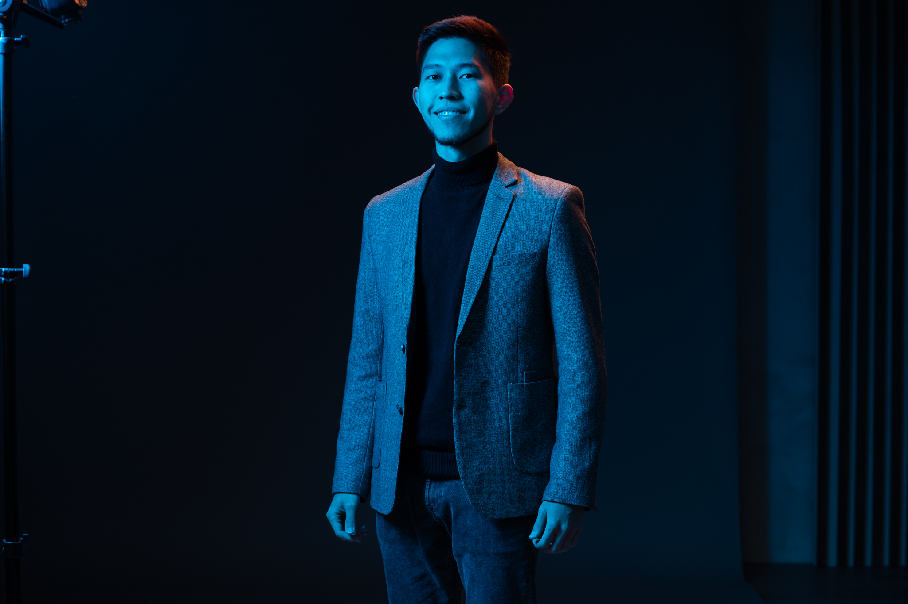

My name is Saidnassimov Darkhan and I am a second year Master's student in Automation and Electrical Engineering at Aalto University. If you want to know more or contact me, scroll down to [contact info](#contact-me).

## Summary

> *"I am a self-driven software engineer with 4 years of professional experience with PLC, SQL, C# .NET, Python and Matlab. I am open to new opportunities in software engineering, machine learning and automation industry. I am passionate about problem solving using state-of-the-art technologies."*
>
> **— Saidnassimov Darkhan**

## Work experience
Currently I am employed as a Thesis worker at Metso Outotec,  and previously was employed as a Software Developer at Redrakon and a Software Engineer at Raute Oyj.

My tech skills include, but not limited to:
---|:---:
Siemens Step7/TIA/CodeSYS/nxtStudio|:white_check_mark:
C# .NET, WPF (Visual Studio)|:white_check_mark:
Arduino(C++)|:white_check_mark:
SQL (MS SQL & MySQL)|:white_check_mark:
Wonderware InTouch HMI|:white_check_mark:
MATLAB & Simulink, COMSOL|:white_check_mark:
Python (numpy, pandas, sklearn, matplotlib, pytorch)|:white_check_mark:
Computer Vision (YOLOv3)|:white_check_mark:
HTML & CSS, REST API|:white_check_mark:
XML, JSON|:white_check_mark:
LabVIEW|:white_check_mark:
ETS5(KNX)|:white_check_mark:
Linux (Ubuntu)|:white_check_mark:
TCP/IP/Firewall|:white_check_mark:
Azure Portal, VMware|:white_check_mark:
Jira|:white_check_mark:
Tortoise SVN, Git/Github|:white_check_mark:
ROS|:white_check_mark:
MS Office|:white_check_mark:

## Education
Sep 2020 - Sept 2022 
- Aalto University, Espoo, Finland [^1]
- Master of Science, Automation and Electrical Engineering

Sep 2015 - Jan 2019 
- HAMK University of Applied Sciences, Valkeakoski, Finland
- B.Eng. in Electrical and Automation Engineering

## Other competences

Finnish Occupational Safety Card, Driving license (B), Covid Vaccinated (Pfizer 3/3)

## Contact me
For more information on my background or work experience, please check my LinkedIn profile. For relevant projects, check my GitHub account from the link below.



For any other matters, send me an email at <darkhan.saidnassimov@gmail.com>

[^1]: [Master's thesis (in development)](https://github.com/darkhan-s/master-thesis-equipment-detection)